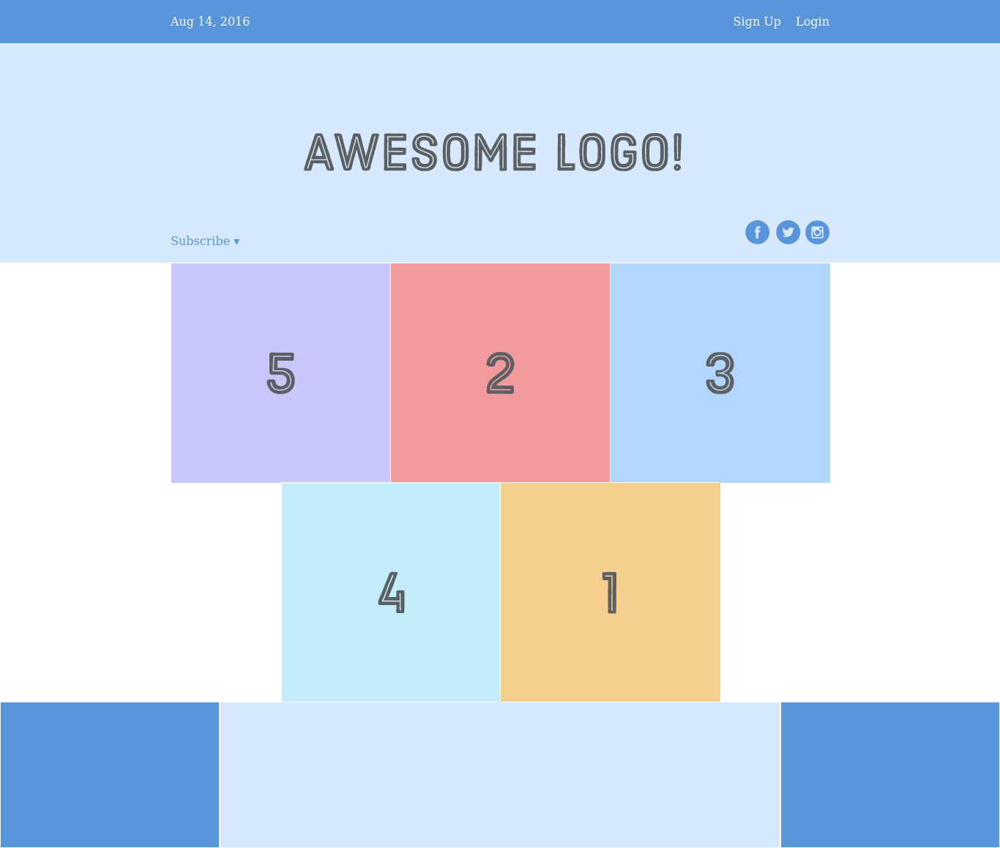

# Interneting Is Hard - Flexbox

This is a solution to the [Flexbox tutorial No. 8 of HTML & CSS Is Hard](https://www.internetingishard.com/html-and-css/flexbox/).

## Table of contents

- [Overview](#overview)
  - [Screenshot](#screenshot)
  - [Links](#links)
- [My process](#my-process)
  - [Built with](#built-with)
  - [What I learned](#what-i-learned)
  - [Continued development](#continued-development)
- [Author](#author)
- [Acknowledgments](#acknowledgments)

## Overview

### Screenshot



### Links

- Solution URL: [Flexbox solution](https://github.com/jugglingdev/flexbox)
- Live Site URL: [Flexbox live site](https://jugglingdev.github.io/flexbox/)

## My process

### Built with

- Semantic HTML5 markup
- CSS custom properties

### What I learned

This tutorial covered how to use Flexbox to define alignment, direction, order, and size of boxes by styling flex containers and their children, flex items.

For horizontal alignment, I learned that the `justify-content` property can take values of `center`, `flex-start`, `flex-end`, `space-around`, or `space-between`.  

Vertical alignment, on the other hand, uses the `align-items` property with values of `center`, `flex-start`, `flex-end`, `stretch`, or `baseline`.

Making a grid was super easy with flexbox.  The code snippet for that is below.

Want your grid to be a column instead of a row?  No problem.  Just use `flex-direction: column`.  Want to center that column?  Use `align-items: center`.  When a row gets turned into a column, I like to picture my head tilting sideways to view it so `justify-center` flips its direction with the column.

Expanding on direction gets you to order.  `flex-direction` can take values such as `row` and `column`, but also `row-reverse` and `column-reverse`.  If you use `row-reverse`, it swaps the order on a per-row basis, so we'd have 321 in the first row and 54 on the next row in this exercise.

So far it's been all about positioning items through their parent containers, but now we get to the items themselves.

First up is flex item order.  The `order` property defines an item's order in the container.  The default value is `0` and increasing like to `1` or decreasing like to `-1` moves the item right or left respectively.  This can be handy when you don't want `row-reverse` or `column-reverse` to order items on a per-row/column basis as `order` works across those boundaries.

`flex-direction` is for the container and `order` is for the item.  Similarly, `align-items` is for the container and `align-self` is for the item and takes the same values as `align-items`.

It just wouldn't be right if we talked about flexbox and not the `flex` property which allows items to have flexible widths.  Here, the default is `1` with `2` being an item that will grow twice as fast.  When used with an explicit `width`, `flex: initial` makes an item static.  This tutorial combined static and flexible items in the footer.

Note that `justify-content` distributes space between items while `flex` distributes space into the items themselves.

The last little trick in this tutorial used `margin-left: auto` in the second menu item to kick `Sign Up` and `Login` to the right.  This is an alternative to using a `<div>` to group items that keeps the HTML flatter.

Code snippets from this exercise include:

```css
/* This is the same as `margin: 0 auto` */
.some-container {
  justify-content: center;
}
```

```css
/* Grid-making magic */
.some-grid {
  width: 900px;
  display: flex;
  justify-content: center;
  flex-wrap: wrap;
}
```

### Continued development

The tutorial mentioned responsive design and mobile layouts like when using `flex-direction: column-reverse`.  I'm curious to see what this means in future tutorials.

I also think I need several flexbox projects to implement and solidify all the principles here.  I like all of the options, but I definitely want to be able to take a mockup and figure out how to code the design.

## Author

- GitHub - [@jugglingdev](https://github.com/jugglingdev)

- freeCodeCamp - [@jugglingdev](https://www.freecodecamp.org/jugglingdev)

- Frontend Mentor - [@jugglingdev](https://www.frontendmentor.io/profile/jugglingdev)

- LinkedIn - [Kayla Paden](https://www.linkedin.com/in/kayla-marie-paden)

## Acknowledgments

Shoutout to Oliver James for his dedication to publishing and maintaining InternetingIsHard.com.  His tutorials were the first that really clicked for me.